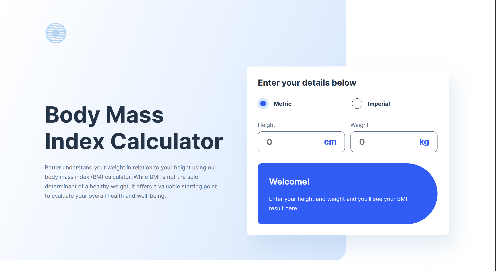

# Frontend Mentor - Body Mass Index Calculator solution

This is a solution to the [Body Mass Index Calculator challenge on Frontend Mentor](https://www.frontendmentor.io/challenges/body-mass-index-calculator-brrBkfSz1T). Frontend Mentor challenges help you improve your coding skills by building realistic projects.

## Table of contents

- [Overview](#overview)
  - [The challenge](#the-challenge)
  - [Screenshot](#screenshot)
  - [Links](#links)
- [My process](#my-process)
  - [Built with](#built-with)
  - [What I learned](#what-i-learned)
  - [Continued development](#continued-development)
  - [Useful resources](#useful-resources)

## Overview

### The challenge

Users should be able to:

- Select whether they want to use metric or imperial units
- Enter their height and weight
- See their BMI result, with their weight classification and healthy weight range
- View the optimal layout for the interface depending on their device's screen size
- See hover and focus states for all interactive elements on the page

### Screenshot

### Links

- Live Site URL: [BMI Calculator](https://fem-body-mass-index-calculator.vercel.app/)

## My process

### Built with

- Semantic HTML5 markup
- CSS custom properties
- Flexbox
- CSS Grid
- Mobile First workflow
- [Vite](https://vite.dev/guide/) - build tool

### What I learned

- Polished grid layout building skills.
- Dividing project into sections and styling them according to different screen sizes.
- Layouts having container wrapper styles and full bleed styles (containers that go outside the wrapper).

### Continued development

- Adding other parameters that are required to calculate an accurate BMI (age, gender, physical activity).
- Polishing full bleed styles for the layout.

### Useful resources

- [CSS Tricks Grid layout guide](https://css-tricks.com/snippets/css/complete-guide-grid/) - This helped me create grid layout.
